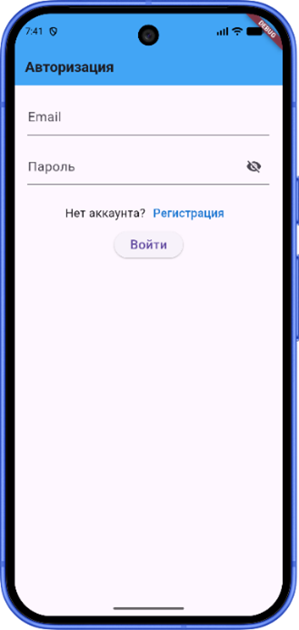
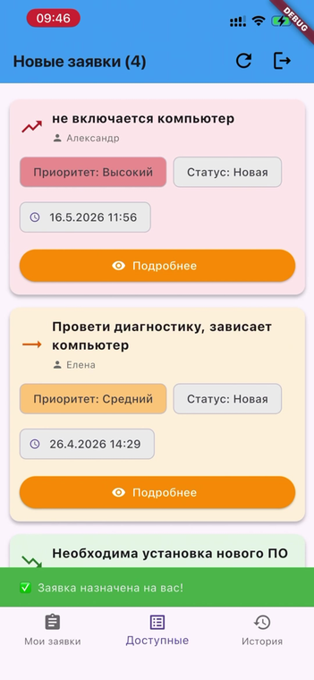
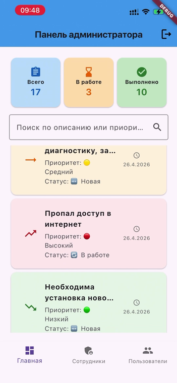
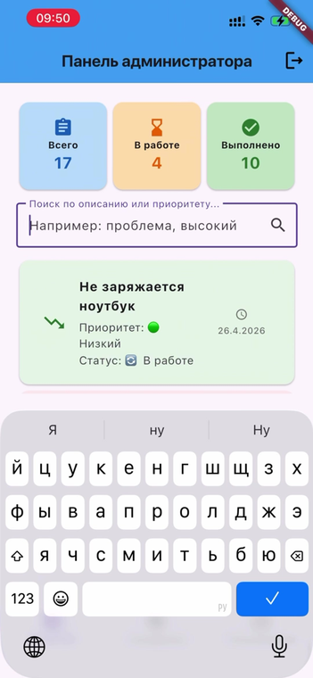
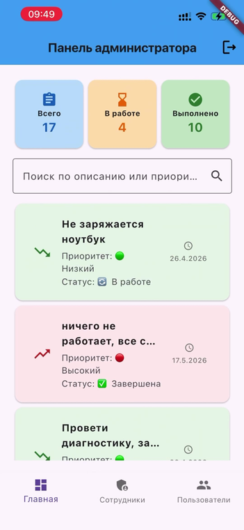

<div align="center">

# 🛠️ HelpDesk Mobile — Приложение для службы технической поддержки

**Кроссплатформенное мобильное приложение для автоматизации сбора, обработки и отслеживания заявок технической поддержки**

[](https://flutter.dev)
[](https://dart.dev)
[](https://firebase.google.com)
[](#)
[](#)


</div>

---

## 📖 О проекте

**HelpDesk Mobile** — единое кроссплатформенное приложение, которое заменяет разрозненный учёт заявок технической поддержки (звонки, чаты, таблицы) на прозрачную цифровую систему с ролевым доступом и синхронизацией в реальном времени.

Проект решает типичные проблемы «ручной» техподдержки: непрозрачность статусов заявок для пользователей, потерю обращений, отсутствие единой очереди у специалистов и невозможность контролировать нагрузку. Все данные хранятся в облаке и мгновенно синхронизируются между устройствами.

> Приложение разработано как выпускная квалификационная работа на примере процессов технической поддержки крупной розничной компании и доведено до состояния, готового к внедрению.

---

## 📱 Скриншоты

<div align="center">

| Авторизация | Список заявок | Создание заявки | Детали заявки | Панель администратора |
|  |  |  |  |  |

</div>

---

## ✨ Возможности

### 👤 Для пользователя
- 📝 Создание заявки с подробным описанием и прикреплением фотографий
- 📋 Просмотр списка своих заявок со статусом и датой создания
- 🔍 Детальная карточка заявки: автор, описание, статус, приоритет
- 👥 Личный кабинет с редактированием персональных данных (ФИО, должность, кабинет, телефон)
- 📊 Личная статистика по созданным заявкам

### 🧑‍💻 Для сотрудника техподдержки
- 📥 Единая очередь всех поступивших заявок и заявок «в работе»
- 🔄 Смена статуса заявки: **Новая → В работе → Закрыта**
- 💬 Комментарий о выполненной работе при закрытии заявки

### 🛡️ Для администратора
- ⚙️ Изменение приоритета и принудительное назначение исполнителя
- 👥 Полное управление учётными записями: создание, изменение, удаление
- 🔐 Полный доступ ко всем функциям системы

---

## 🔐 Ролевая модель

Система разграничивает права доступа между тремя ролями:

| Роль | Права доступа |
|------|---------------|
| **Пользователь** | Создание и просмотр собственных заявок, ведение личного кабинета |
| **Сотрудник техподдержки** | Обработка очереди заявок, смена статусов, комментарии |
| **Администратор** | Полный контроль: приоритеты, назначение исполнителей, управление аккаунтами |

---

## 🏗️ Архитектура

Приложение построено по паттерну **MVVM (Model–View–ViewModel)**, обеспечивающему чёткое разделение ответственности между слоями представления, бизнес-логики и данных.

```
┌─────────────────┐     ┌──────────────────┐     ┌─────────────────┐
│      View       │────▶│    ViewModel     │────▶│      Model      │
│   (виджеты UI)  │◀────│  (бизнес-логика) │◀────│  (данные, API)  │
└─────────────────┘     └──────────────────┘     └─────────────────┘
        ▲                                                  │
        │            реактивное обновление UI              │
        └──────────────── StreamBuilder ◀──────────────────┘
```

- **View** — экраны и виджеты, реактивно перестраиваются через `StreamBuilder` при изменении данных
- **ViewModel** — бизнес-логика, независимая от конкретных виджетов (легко тестируется изолированно)
- **Model** — модели данных и взаимодействие с облачными сервисами

---

## 🧰 Технологический стек

| Компонент | Технология | Назначение |
|-----------|-----------|------------|
| **Framework** | Flutter | Единая кодовая база для Android и iOS |
| **Язык** | Dart | Язык разработки приложения |
| **Аутентификация** | Firebase Authentication | Безопасный вход и разделение по ролям |
| **База данных** | Cloud Firestore | NoSQL-хранилище с синхронизацией в реальном времени |
| **Хостинг изображений** | ImgBB | Хранение фотографий, прикреплённых к заявкам |

**Почему Flutter?** Единый графический движок Skia обеспечивает стабильную производительность (60–120 FPS) и единообразие интерфейса на всех платформах, а одна кодовая база сокращает время и стоимость разработки и упрощает сопровождение.

---

## 🚀 Запуск проекта

### Требования
- [Flutter SDK](https://docs.flutter.dev/get-started/install) (stable)
- Аккаунт [Firebase](https://console.firebase.google.com/)
- API-ключ [ImgBB](https://api.imgbb.com/)

### Установка

```bash
# 1. Клонировать репозиторий
git clone https://github.com/AlehandroAntonov/<repository-name>.git
cd <repository-name>

# 2. Установить зависимости
flutter pub get

# 3. Настроить Firebase (см. ниже), затем запустить
flutter run
```

### Настройка Firebase
1. Создайте проект в [Firebase Console](https://console.firebase.google.com/)
2. Включите **Authentication** (Email/Password) и **Cloud Firestore**
3. Добавьте конфигурацию через `flutterfire configure` (создаст `firebase_options.dart`)
4. Укажите свой ключ **ImgBB API** в конфигурации приложения

---

## 🎥 Демонстрация

Видеодемонстрация работы приложения доступна в репозитории / релизах.

---

## 📊 О разработке

Приложение спроектировано и реализовано полностью самостоятельно: от анализа бизнес-процесса технической поддержки и сравнения существующих решений (Zendesk, Freshdesk, Битрикс24, Мегаплан, Naumen) до проектирования архитектуры, реализации и тестирования. Проведён сравнительный экономический анализ, подтвердивший целесообразность собственной разработки по сравнению с покупкой готового решения.

---

## 👨‍💻 Автор

[@AlehandroAntonov](https://github.com/AlehandroAntonov)

---

</div>
